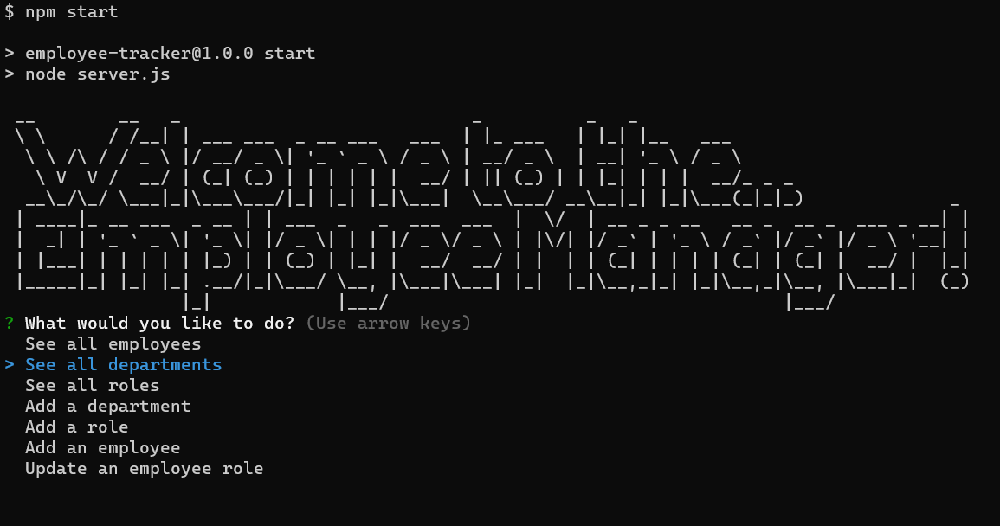
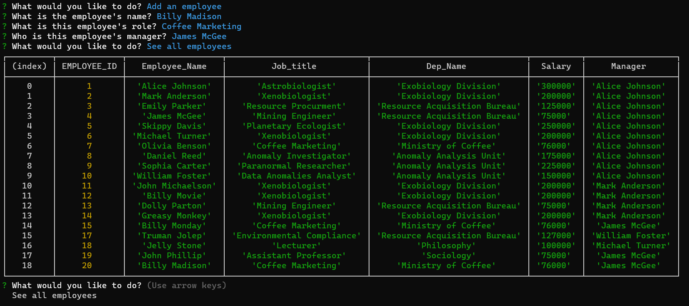

# SVG logo maker 
  
## Description
  
Manage your company database with our ultra-light, user-friendly CLI app! With a developer-friendly interface, you can easily and quickly alter one of many qualities of the employee information stored in your database. Download the package, install, and begin!
  
## Table of Contents
  
-[Installation](#installation)
  
-[Usage](#usage)
  
-[License](#license)
  
-[Credits](#credits)
  
-[Contributions](#how-to-contribute)
  
## Installation
  
You must have node installed on your machine for this program to run. To check if you have node already installed, run the following code in your terminal:

`node --version`

If you see something like (but perhaps different numbers for another version)

`v18.18.2`

you're all set! If not, enter the following:

`npm init -y`

followed by 

`npm i`

Make sure you also have the 'inquirer' package. Very important! The program will be unable to prompt you for information without this package. Run this command to install inquirer:

`npm i --save inquirer@8.2.4`

Next, you will need to make sure you can connect to your database. In a .env file, save your user credentials so they can be properly passed to MySQL for login. In addition, you will want to make sure that the database name is correct; this line can be found in the server.js file at the root of the repository.

Once you've done all of that, you are good to go!
  
## Usage
  
Use the command line to navigate to the directory where the program is located. Then, type the following command in your terminal:

`npm start`

Follow the prompts you see before you! The home screen will look like this:

Simply select the option that fits your needs. After finishing the subsequent prompts through a choice, you will be returned to the main menu where you can select a different option. For instance, selecting 'Add an employee' will ask you for the employee's name, their role, and who their manager should be. After you answer those questions, they will be added to the database. You can then verify this by selecting 'See all employees'.

For a more in-depth look, please follow the link below to a walkthrough of all of our features:

[Video](https://watch.screencastify.com/v/dmRRQCuaWOWMqRgpl5o8)
  

## License

[This project uses the following license: MIT](https://opensource.org/licenses/MIT)

## How to Contribute
  
Please contact me on github or through my email listed below if you have any ideas or want to help extend my project!

## Questions

[Please follow this link to my GitHub profile!](https://github.com/kurtriecken)

For any additional questions, please [email me here.](mailto:kurt.riecken@gmail.com)

## Credits
  
[Kurt Riecken](https://github.com/kurtriecken)